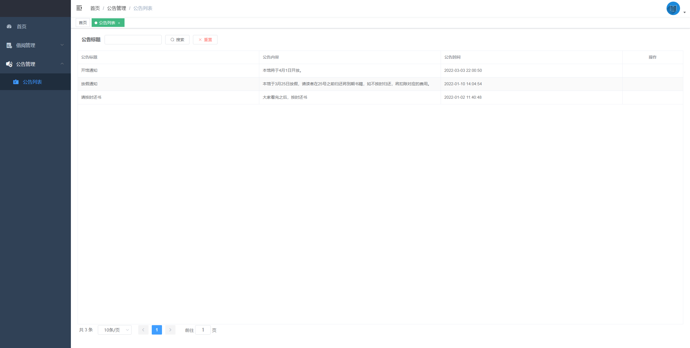

# 易学图书管理系统

##（源代码+12000字文档+ppt）

## 项目简介

易学是一套针对学校借书的多角色图书管理系统，分为读者与管理员。 
管理员可对图书进行管理、发布通知公告、管理图书借阅、图书归还等操作。 
读者可对图书进行查询、借阅等，可查看公告信息以及自己的借阅记录。 
本系统采用前后端分离架构，后台采用Springboot+Mybatis，前端开用VUE+ElementUI。 
涉及技术均为当前比较新进技术架构，难度适中，非常适合作为设计或学习使用。 

## 技术服务

## 技术栈

| 工具及技术             | 版本    |
| ---------------------- | ------- |
| idea                   |         |
| JDK                    | 1.8     |
| SpringBoot             | 2.2.1   |
| MyBatis                | 1.3.2   |
| JWT                    | 3.4     |
| Vue                    | 2.0     |
| ElementUI              | 2.0     |
| MySQL                  | 5.7     |
| Node                   | v16.16.0|

## 安装教程

1.代码分为两部分，boot-project-web是前端代码，itmk-base-parent是后端代码。 
2.安装开发环境jdk、node.js、vscode、idea/eclipse、MySQL5.7。 
3.在mysql中创建数据库blog，导入vue-books-project.sql。 
4.启动前端程序和后端程序即可。 
5.访问http://localhost:9528     登录首页 

## 系统图片

#### 1.登录页
 
#### 2.管理后台首页
 
#### 3.读者列表
 
#### 4.图书列表
 
#### 5.借书管理
 
#### 6.借阅查看
 
#### 7.公告列表
 